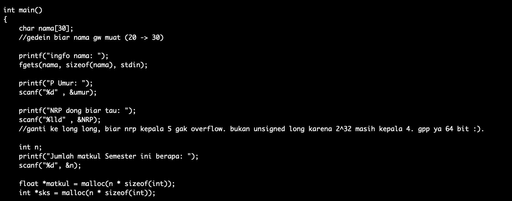
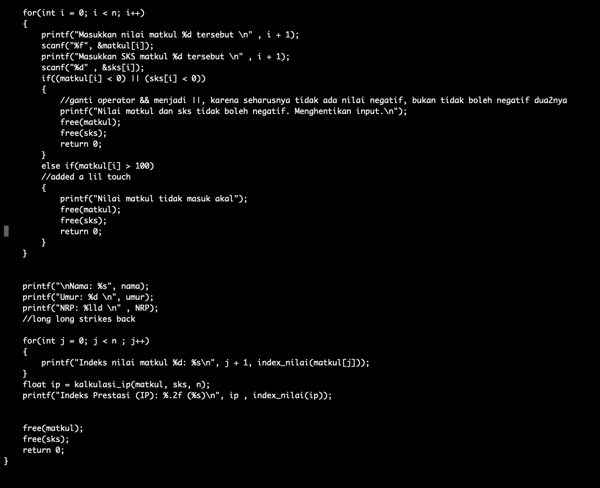
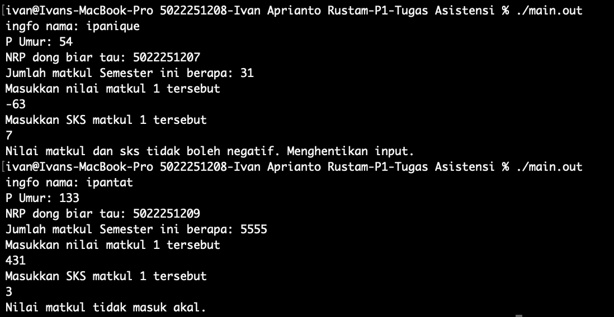
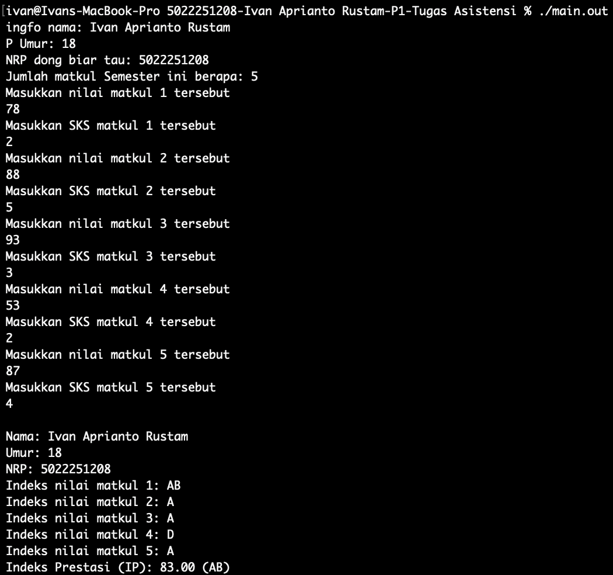

# halo
seperti instruksi yang diberikan, saya telah membenarkan kode dan menambahkan beberapa fitur, tapi sebelum mulai saya ingin minta maaf atas tampilan yang membosankan, karena saya edit pake nano di terminal saya\
saya juga maaf keluarannya .out karena saya pengguna macos (harap compile sendiri)

program dicompile gcc-17\
atau lebih tepatnya
```
Apple clang version 17.0.0 (clang-1700.0.13.5)
Target: arm64-apple-darwin24.6.0
Thread model: posix
```

# CODE

## deklarasi


seperti yang diketahui kita semua, C sangat tidak suka jika ada yang tidak dideklarasikan, jadi saya buatlah deklarasi variabel dan juga include library yang digunakan (stdio buat operasi i/o, stdlib buat memory management)

## prototype fungsi


fungsi-fungsi di C perlu mempunyai prototypenya sebelum dijalankan, maka disini saya buatlah prototypenya.

## fungsi


ini fungsi 1, tinggal baca itu commentnya


fungsi 2, sama
saya juga tambah (float) biar dijamin 100% no fake keluarannya float

### bonus 
seperti yang bisa dilihat, saya penganut Allman indentation style, dimana tiap curly bracket menempati barisnya sendiri dan mengikuti indentasi parent functionnya.

## main


disini ada beberapa edit yang saya buat.\
pertama ukuran array buat charnya saya gedein, biar nama saya muat\
lalu saya ganti data type nrp dari integer menjadi long long, karena 2^32 ga nyampe 50xxxxxxxx, jadi kalo saya prodi d4 ya ga akan saya ganti



lalu ada beberapa modifikasi di bagian for loop utama\
pertama, operator && saya ganti jadi ||, karena jika menggunakan && saya masih bisa aja bikin salah satu nilainya negatif\
kedua ya saya tambahin limit buat nilai matkul (100), ga ada limit sks karena saya lupa sks paling gede berapa

# OUTPUT

## FAIL


inilah dua kasus yang akan menggagalkan program.

## SUCCESS


dan ini contoh keberhasilan
