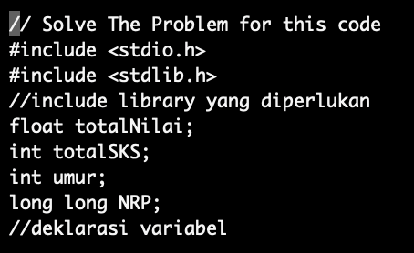

# halo
seperti instruksi yang diberikan, saya telah membenarkan kode dan menambahkan beberapa fitur

## deklarasi

seperti yang diketahui kita semua, C sangat tidak suka jika ada yang tidak dideklarasikan, jadi saya buatlah deklarasi variabel dan juga include library yang digunakan

## prototype fungsi

fungsi-fungsi di C perlu mempunyai prototypenya sebelum dijalankan, maka disini saya buatlah prototypenya.

### bonus 
seperti yang bisa dilihat, saya penganut indentation style GNU, dimana tiap curly bracket menempati barisnya sendiri dan mengikuti indentasi parent functionnya.

## fungsi

ini fungsi 1

fungsi 2
